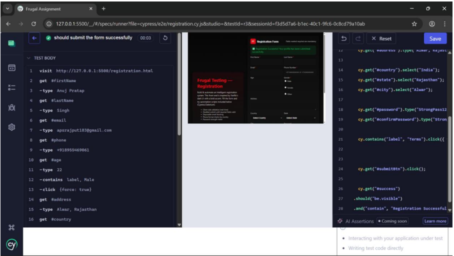
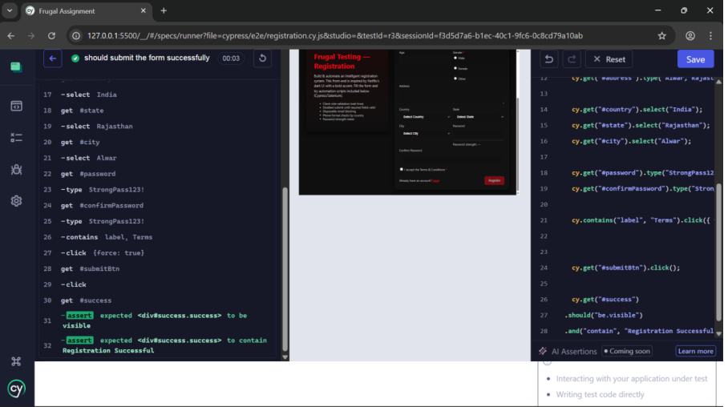

# Intelligent Registration System with Cypress Automation

## Overview

This project demonstrates the development and automated testing of a modern web-based **Registration System**.

The application includes a responsive registration form with multiple input fields and client-side validation. Automated testing is implemented using **Cypress** to simulate user interactions and verify correct form behavior.

The project showcases how **software development and automated testing work together** to ensure reliability and quality in web applications.

---

## Tech Stack

- HTML  
- CSS  
- JavaScript  
- Cypress (Automation Testing)

---

## Features

- Responsive registration form UI
- Client-side validation for required fields
- Email and phone validation
- Password confirmation validation
- Dynamic dropdown selection (Country → State → City)
- Success message on valid submission
- Automated UI testing using Cypress

---

## Registration Form Fields

The registration system includes the following inputs:

- First Name  
- Last Name  
- Email  
- Phone Number  
- Age  
- Gender  
- Address  
- Country  
- State  
- City  
- Password  
- Confirm Password  
- Terms and Conditions  

The form validates user input before allowing submission.

---

## Automation Testing with Cypress

Automation testing is implemented using **Cypress** to ensure the reliability of the registration form.

The Cypress automation script performs the following steps:

1. Launch the registration page  
2. Enter valid user information  
3. Select dropdown values  
4. Validate required fields  
5. Submit the form  
6. Verify that the success message appears  

Example success validation:

```javascript
cy.get("#successMessage")
  .should("be.visible")
  .and("contain", "Registration Successful")
```

If the success message appears, the test passes successfully.

---

## Project Structure

```
Intelligent-Registration-System-Automation
│
├── registration.html
├── cypress.config.js
│
├── cypress
│   └── e2e
│       └── registration.cy.js
│
├── screenshots
│
└── README.md
```

---

## Running the Project

Open the registration form in your browser:

```
open registration.html
```

or simply double-click the file to open it.

---

## Running Automation Tests

Install Cypress:

```
npm install cypress
```

Run Cypress Test Runner:

```
npx cypress open
```

Then select the test file:

```
registration.cy.js
```

The automation script will run and verify the registration process.

---

## Application Screenshots

### Registration Form Interface



---

### Cypress Automation Script



---


---


---

## Learning Outcomes

Through this project I learned:

- Designing responsive web forms
- Implementing client-side validation
- Automating UI testing using Cypress
- Simulating real user behavior through automation
- Ensuring reliability of web applications through automated tests

---

## Future Improvements

- Add backend integration using Node.js
- Store user data in a database
- Implement API testing
- Integrate CI/CD pipelines for automated testing

---

## Author

**Anuj Pratap Singh**  
B.Tech CSE (AI & ML)  
UPES Dehradun  

GitHub:  
https://github.com/anujpratap12
